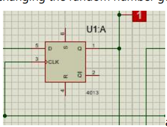

# Introduction
A random number generator (RNG) is a device that generates a sequence of numbers or symbols that cannot be reasonably predicted. 

The digital logic design of random number generators using basic
components is a popular topic among digital IC designers in terms of their
speed compatibility and uncomplicated integration to digital platforms. The most common method for generating random numbers using digital logic
is to use **shift registers**. A shift register is a digital circuit that can be used to
store and shift data. It can be used to generate random numbers using feedback from the output of the shift register to its input. Another method for generating random numbers using digital logic is to use
oscillators. Oscillators are circuits that produce periodic signals. By using two
oscillators with different frequencies and feeding their outputs into an XOR
gate, it is possible to generate a random sequence of bits. As mentioned earlier, shift registers are commonly used in digital logic design of random number generators. 

A shift register is a digital circuit that
can be used to store and shift data. It can be used to generate random
numbers by using feedback from the output of the shift register to its input. There are several ways to implement shift registers for random number generation. One such method is the XORing Shift Registers (XSR) scheme. XSR
generates multiple uncorrelated true random bitstreams using only two true
random number generators as entropy sources and can thus be implemented
by a variety of logic devices
Another method for generating random numbers using shift registers is to use
Linear Feedback Shift Registers (LFSRs). LFSRs provide a simple means for
generating non sequential lists of numbers quickly on micro controllers. Generating the **pseudo-random** numbers only requires a right-shift operation
and an XOR operation. 

**In this proteus simulation shift registers will be used with a linear feedback network and a corresponding decimal will be** **shown using a segment display**

## Componet used
The following components were used in the Proteus simulation. 
- a D type flip flop(4013) - XOR gate
- OR gate
- NAND gate
- NOT gate
- AND gate
-Logic toggle
-Logic probe
- 7 segment bcd display
## Procedure
1, six D type flip flops were connected in series and a logic probe was connected at the output of each of the flip flops to observe the binary output of the shift register.

2, a clock was connected using a logic toggle to each of the six flip flops. 

3, a single click on the clock will simulate a change in clock and hence
changing the randomly generated number. 

fig1: a flip flop with its logic probe at output

4, a parallel load input is required in order to change the seed(initial value) of
our random number generator. Parallel load will give the simulation more
flexibility by enabling the user to select the initial value of randomness. 

5, a parallel load was achieved by using a series of OR and Gates. Using a logic
toggle the simulation can change its mode of work from shift to load and load
to shift

Fig2: the parallel Load of the shift register

6, the output of the last 3 flip flops were connected to the input of the first flip
flop through different gates to create the random numbers . 

7, the 6 outputs of the flip flops were connected to two 7segment bcd displays
to change the binary values to decimal. 

8, the output of the flip flops were connected in a way to avoid the range of
the 7 segment that connect letters(A-F). hence only showing numbers.

fig3: full circuit

